# Setting up a new product in the Enate SDLC Factory

**A hands-on walkthrough of the one-time project setup — from an empty GitHub repo to a
Factory-ready project that Claude can build against.**

> **Who this is for.** Anyone standing up a *new* product to run through the Factory for the
> first time. It assumes no prior knowledge — every click is spelled out, with the reasoning
> behind it and the traps to avoid. If you've done this before and just want the checklist,
> jump to [The whole thing on one page](#the-whole-thing-on-one-page).
>
> **The worked example.** This guide follows the real setup of **WeatherPOC2** — GitHub repo
> `DeekAaron/WeatherPOC2`, ADO project in the **Enate Internal** organisation. Swap those names
> for your own product as you go.
>
> **Where this sits in the bigger picture.** This is the *plumbing* stage — it happens **once**,
> before any product work. When you finish, you'll have a repo, an ADO project, the access wired
> up, and `/init-repo` run. Only *then* does the Factory's **HITL → AFK** flow begin
> (`/init-context`, `/roadmap`, and so on — see
> [Using the Enate SDLC Factory](https://github.com/kitcox-dev/enate-claude-skills/blob/main/docs/using-the-sdlc-factory.md)).

---

## Before you start — the mental model

Five ideas make everything below click. Read these first; the steps are much easier when you
know *why* you're doing them.

### 1. There are **two** GitHub connections, and they are not the same thing
- **The GitHub App ("Claude")** — installed on your repo, this is what lets Claude *act* on
  GitHub (open pull requests, read issues, run from the repo). You grant it access per-repo.
- **A fine-grained Personal Access Token (PAT)** — a credential Claude uses to talk to the repo
  programmatically. Separate from the App, generated separately, scoped separately.

You set up **both**. They cover different things; missing either leaves Claude half-connected.

### 2. There are **two** Azure DevOps organisations — pick the right one
- **Enate (factory / customer org)** — SOC 2-bound, for real delivery work.
- **Enate Internal** — for internal POCs and "dummy" projects that *don't* need to sit inside the
  SOC 2 boundary.

For a POC like this, **everything goes in Enate Internal.** Putting a throwaway project in the
customer org is the classic wrong turn.

### 3. Tokens are secrets — treat them like passwords
The GitHub PAT and the ADO PAT are live credentials. **Never** paste them into a document, a
committed file, or a screenshot. Store them in a password manager or your OS secure store. You
can always **regenerate** either token later (same screen you created it on) — a lost token is a
30-second fix, a *leaked* token is an incident. See [Security note](#security-note-on-tokens).

### 4. Connector permissions are set once so Claude doesn't nag you mid-build
Claude's Azure DevOps connector exposes lots of tools. Left at defaults, Claude stops and asks
permission constantly ("can I read this work item?"). You **pre-approve** the safe, read/write
work-tracking tools up front, and leave the destructive ones (delete, pipelines) asking. This
buys a smooth build session with the risky operations still gated.

### 5. `/init-repo` is the finish line of setup — and the start of everything else
The last step points Claude at your new repo and runs the **`/init-repo`** skill. That's what
generates the `.factory.yml` (the file that tells the Factory which ADO org/project this repo's
work lives in). After `/init-repo`, setup is done and product work can begin.

---

## What to have ready

Line these up before you start — the flow is smooth if you're not hunting for things mid-way:

- [ ] A **GitHub account** you can create repos under.
- [ ] The **GitHub App configuration link** for Claude (`https://github.com/apps/claude`) —
      the "give Claude access to this repo" link.
- [ ] Access to the **Enate Internal Azure DevOps organisation**. *This is the one to sort
      early* — in the recorded session it wasn't granted yet and someone had to be pulled in to
      add it. If `dev.azure.com` doesn't show **Enate Internal** in your org switcher, request
      access before you start (ask your ADO admin).
- [ ] A **password manager / secure place** to hold two tokens.
- [ ] **Claude on the web** open and signed in.
- [ ] A browser **bookmark folder** with the above links — small thing, saves a lot of
      alt-tabbing (Cristina's tip in the walkthrough).

---

## The flow at a glance

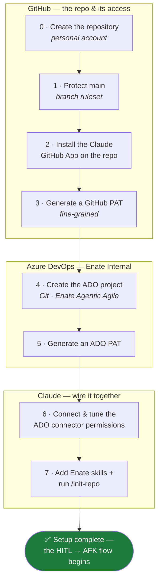

The three bands map to the three tools you touch, in order: **GitHub → Azure DevOps → Claude**.

---

## Phase 0 · Create the GitHub repository

> **Why.** Everything hangs off the repo — it's the home for the product's code, docs, and the
> `.factory.yml`. It lives in *your personal* GitHub account for a POC.

1. In GitHub, create a **new repository** under your account — e.g. `DeekAaron/WeatherPOC2`.
2. Give it a name that matches the product. Keep the rest at defaults for now; the Factory files
   get generated later by `/init-repo`.

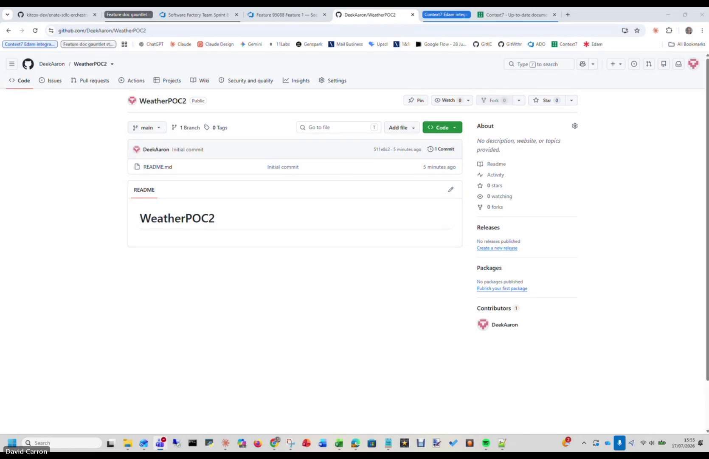
*The new `DeekAaron/WeatherPOC2` repo, moments after creation — a single initial commit and a
bare README.*

> ⚠️ **Gotcha.** The actual "New repository" form happened *before* the recorded walkthrough
> began, so the shot above is the repo immediately after creation. It's a standard GitHub
> "New repository" — nothing Factory-specific here yet.

---

## Phase 1 · Protect `main` with a branch ruleset

> **Why.** The Factory's cardinal rule is that **`main` only ever moves through a reviewed pull
> request that passes CI** — never a direct commit. A branch ruleset is how GitHub enforces that.
> Doing it now means the guardrail is live from commit one. *(Once `/init-repo` runs, the repo
> gets a `CONTRIBUTING.md` that spells this rule out in full.)*

1. In the repo, go to **Settings → Rules → Rulesets**.
2. Create a **New ruleset → New branch ruleset**.
3. **Ruleset name:** `Protect Main`.
4. **Enforcement status:** **Active**.
5. Leave **Bypass list** empty (skip it).
6. **Target branches → Add target → Include default branch** (i.e. `main`).
7. Under **Branch rules**, tick:
   - ☑ **Restrict deletions**
   - ☑ **Require linear history**
   - ☑ **Require a pull request before merging**
   - ☑ **Block force pushes** *(usually already on — leave it)*
8. **Save changes.**

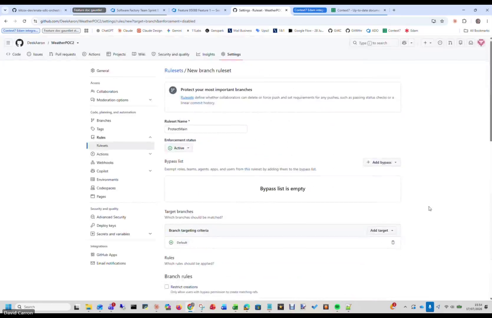
*The ruleset header: name `ProtectMain`, Enforcement status **Active**, empty bypass list, and
target = **Default** branch.*

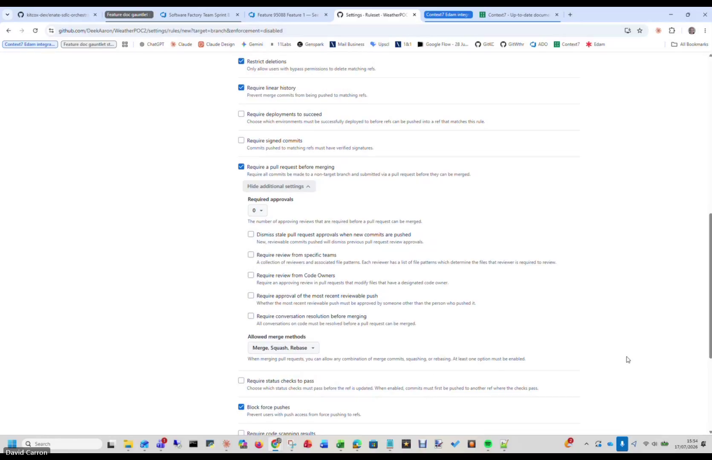
*The branch rules, scrolled down: **Restrict deletions**, **Require linear history**, **Require a
pull request before merging**, and **Block force pushes** all ticked. (Required approvals is left
at 0 here — see the callout below on also requiring the `ci` check.)*

> ✅ **Factory standard — also require the `ci` check.** The Factory stamps every repo with a CI
> workflow whose job is named **`ci`** (secret-scanning with gitleaks, Actions pinned by SHA) —
> it lands at `.github/workflows/ci.yml` once `/init-repo` scaffolds the repo. The Factory expects
> `main` to require that check to pass before a PR can merge. If your ruleset screen offers
> **"Require status checks to pass"**, add **`ci`** to it (you can do this now, or come back after
> `/init-repo` once the check has run at least once and is selectable).

> ⚠️ **Gotcha.** "Rulesets" is the modern location — don't confuse it with the older
> "Branch protection rules" screen. Either can work, but the Factory convention is a **ruleset**
> named `Protect Main`.

---

## Phase 2 · Install the Claude GitHub App on the repo

> **Why.** This is what lets **Claude act on GitHub** on your behalf — run from the repo, open
> pull requests, read issues. Without it, Claude can't reach your repository at all.

1. Open the **Claude GitHub App configuration link**: `https://github.com/apps/claude`
   (in the recording, Cristina shared this link in the Teams chat — keep it in your bookmark
   folder).
2. Choose **Configure**, and when prompted for repository access, pick
   **Only select repositories**.
3. In the **Select repositories** dropdown, choose your **new repo** (`WeatherPOC2`).
4. **Save.** GitHub confirms the App now has access; you'll be redirected back toward Claude.

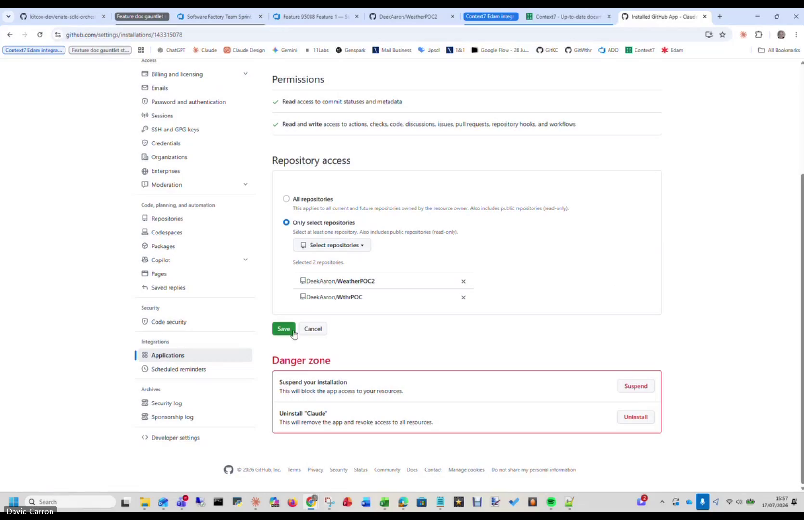
*The App's granted **Permissions** (read/write to code, PRs, issues, workflows and more) and
**Repository access** set to *Only select repositories* — here `WeatherPOC2` (and `WthrPOC`) are
selected. Hit **Save**.*

> ⚠️ **Gotcha.** This is the **App install/permission** — it is *not* the PAT (that's next).
> They're easy to conflate because both are "giving Claude access to GitHub". You need both.

---

## Phase 3 · Generate a GitHub PAT (fine-grained)

> **Why.** A **fine-grained Personal Access Token** is the credential Claude uses to interact
> with the repo's contents and pull requests programmatically. Scope it tightly — only the new
> repo, only the permissions needed.

1. Go to **GitHub → Settings → Developer settings → Personal access tokens →
   Fine-grained tokens** (`https://github.com/settings/personal-access-tokens`).
2. **Generate new token** (if you have an old placeholder token here, you can delete it or
   override it).
3. **Name:** anything memorable (it genuinely doesn't matter).
4. **Resource owner:** your account. **Repository access:** *Only select repositories* → your
   new repo.
5. **Repository permissions** — set these to **Read and write**:
   - **Contents** — Read and write
   - **Metadata** — Read-only *(selected automatically; required)*
   - **Pull requests** — Read and write
   - **Workflows** — Read and write
6. **Generate token.** **Copy it immediately** and store it in your password manager. If you had
   one saved before, **override** it with this new value.

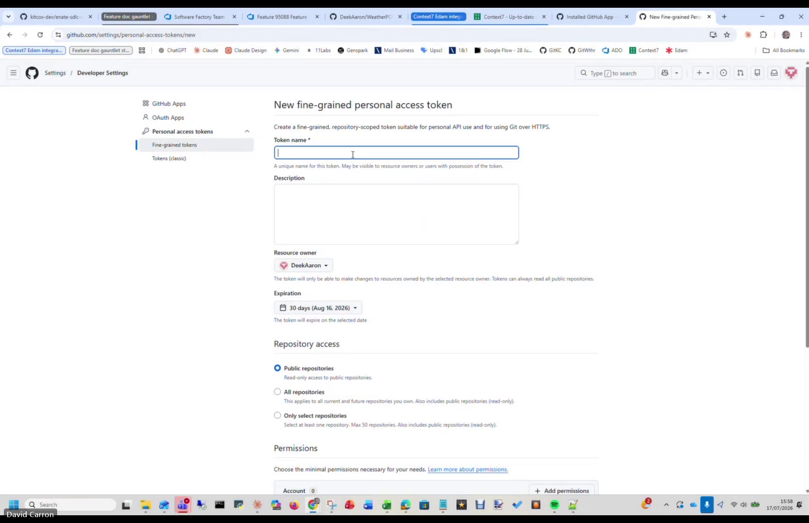
*Creating the token: give it a name, set **Resource owner** to your account, and **Repository
access** to *Only select repositories* → your repo.*

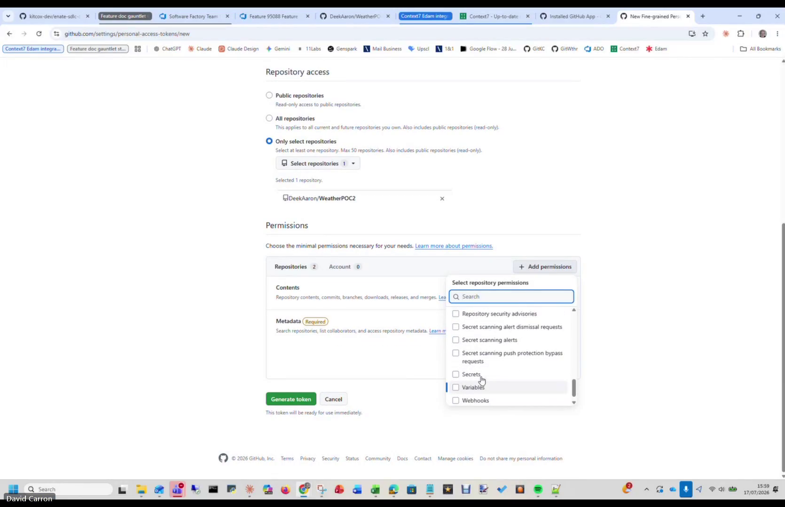
*The **Permissions** section — **Contents** and **Metadata** (Metadata is *Required* and added
automatically); use **Add permissions** to include **Pull requests** and **Workflows**, each set
to **Read and write**.*

> ⚠️ **Gotcha — the token shows once.** GitHub displays the token value a single time. Copy it
> then. If you miss it, don't panic — just **regenerate** (same screen); it mints a fresh value.
> **Never** screenshot the token value or save it to a synced file. See
> [Security note](#security-note-on-tokens).

---

## Phase 4 · Create the Azure DevOps project (Enate Internal)

> **Why.** The ADO project is where the Factory's **work items** live — the Features and Stories
> that drive the build. It must sit in the **Enate Internal** org and use the **Enate Agentic
> Agile** work-item process so the Feature/Story shapes are right.

1. Open **Azure DevOps** (`dev.azure.com`).
2. In the org switcher (left / top bar), select the **Enate Internal** organisation.
   - **If you don't see it:** you don't have access yet. Get it granted before continuing — this
     is the step most likely to block you (it did in the recorded session).
3. **New project.**
4. **Name** it for your product (e.g. `WeatherPOC2`). The name itself is flexible.
5. Expand **Advanced** and confirm:
   - **Version control:** **Git**
   - **Work item process:** **Enate Agentic Agile** *(this template gives you the Feature → Story
     hierarchy the Factory uses)*
6. **Create project.**

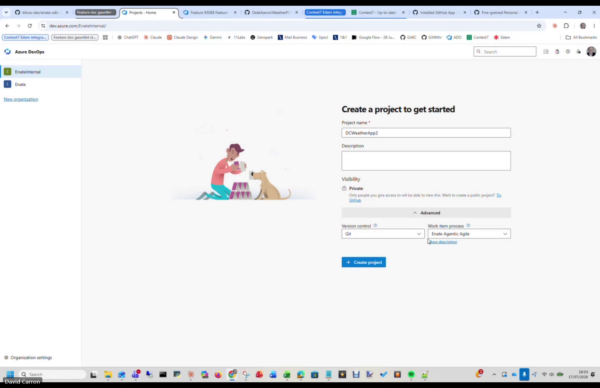
*Creating `DCWeatherApp2` in the **EnateInternal** organisation (see the org list on the left),
with **Advanced** expanded: **Version control = Git**, **Work item process = Enate Agentic
Agile**.*

> ⚠️ **Gotcha — right org.** Confirm the org switcher says **Enate Internal** before you create.
> The internal org is deliberately *outside* the SOC 2 boundary and is the correct home for POCs
> and dummy projects; the customer/factory org is not.
>
> 💡 **Naming note.** If your project's *display name* contains spaces, the Factory uses the
> project **GUID** as the stable coordinate in `.factory.yml` (spaces fall outside the safe
> charset). You don't have to do anything now — just don't be surprised if `.factory.yml` later
> shows a GUID rather than the pretty name.

---

## Phase 5 · Generate an Azure DevOps PAT

> **Why.** Just like GitHub, Claude needs a token to read and update work items in your ADO
> project.

1. In Azure DevOps, click **User settings** (the icon next to your profile picture, top-right) →
   **Personal access tokens**.
2. **+ New Token.**
3. **Name:** anything ("it really doesn't matter — don't overthink it").
4. **Scopes:** grant **Work Items → Read & write**.
5. **Create**, then **copy** the token and store it securely — **override** any earlier one you
   had saved.

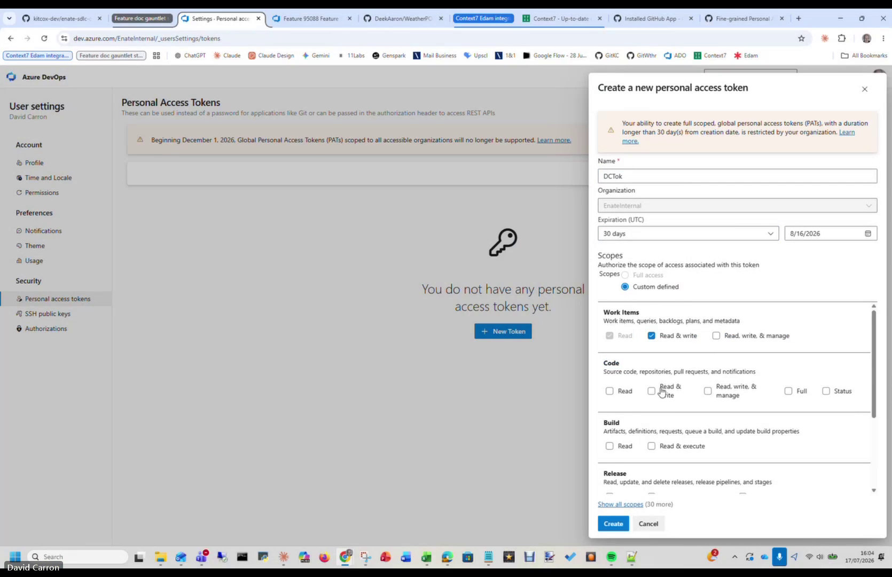
*The **Create a new personal access token** dialog: name it, confirm **Organization =
EnateInternal**, **Scopes → Custom defined**, and tick **Work Items → Read & write**.*

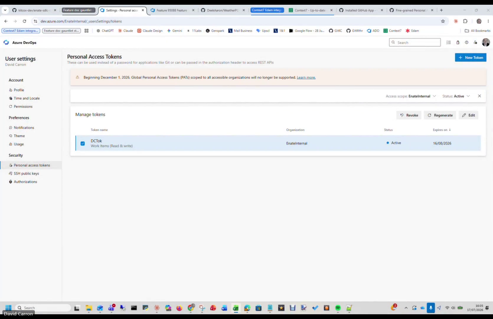
*After **Create**, the token appears under **Manage tokens** (here `DCTok`, Work Items Read &
write). Selecting it reveals **Regenerate** — the escape hatch if you ever lose the value.*

> ⚠️ **Gotcha — same "shows once" rule** as the GitHub PAT, and the **same fix**: you can
> **regenerate** any time from this exact screen, which mints a new token automatically. A lost
> token is nothing to worry about; a leaked one is.

At this point you've completed the manual plumbing: **new repo ✓, branch protection ✓, App
access ✓, and PATs on both the repo and the ADO project ✓.** The rest happens inside Claude.

---

## Phase 6 · Connect and tune Claude's ADO connector

> **Why.** You connect Claude to the **Enate Internal** Azure DevOps org, then pre-approve the
> work-tracking tools so Claude doesn't interrupt every few seconds asking permission — while
> still keeping destructive operations gated.

1. In Claude (web), open **Connectors → Configuration → Customize connectors**.
2. Find the **Azure DevOps (EnateInternal DevOps Organisation)** connector and **Connect** to it.
   - There are **two** Azure DevOps connectors in the list. Plain **"Azure DevOps"** is the
     factory/delivery one; **"Azure DevOps (EnateInternal DevOps Organisation)"** is the one for
     internal/dummy projects. **Connect the EnateInternal one.**

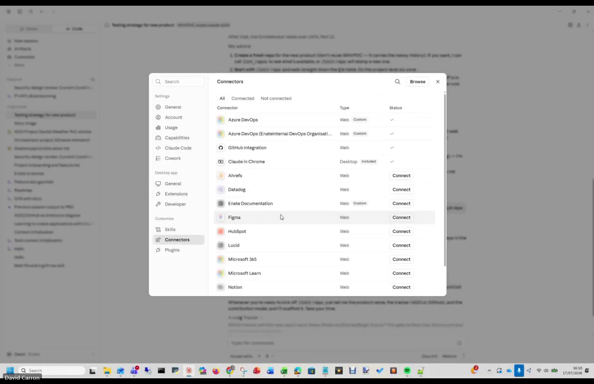
*The connectors list. Note the two Azure DevOps entries — plain **Azure DevOps** and **Azure
DevOps (EnateInternal DevOps Organisation)**. Connect the EnateInternal one (GitHub Integration
is already connected here too).*
3. **Approve** the connection when prompted. *Do this promptly* — the approval pop-up
   **times out** if you leave it hanging, and you'll have to start over.
4. Now set **auto-approve vs ask** per tool. The principle: **auto-approve the read/write
   work-tracking tools; leave destructive and out-of-scope tools asking.**

   **Auto-approve (safe, used constantly):**
   - Everything prefixed **`bridge`** (the ADO bridge tools)
   - **Search work item**
   - **Wiki** *(optional but handy — lets Claude store temporary docs in the ADO wiki)*
   - **Backlog**
   - Everything prefixed **`wit`** (work-item tracking)
   - **Work item comment**
   - **Iteration**

   **Leave asking / don't auto-approve:**
   - **Pipelines** (you don't run these here)
   - **Repo** write operations and **search code**
   - Any **delete** tool — *be deliberate with these*

5. Close the settings.

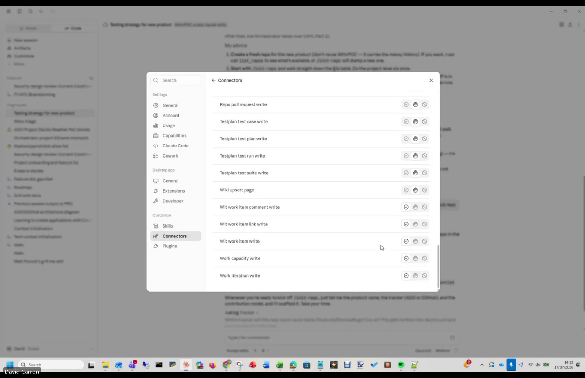
*The per-tool list for the connector — each tool (`Wit work item…`, `Work capacity write`, `Wiki
upsert page`, `Repo pull request write`, and so on) has its own approve/ask toggles. Work down it
setting the work-tracking tools to auto-approve and leaving delete/pipeline tools asking.*

> ⚠️ **Gotcha — the tool list is long and the labels look alike.** Go in order and use the
> prefixes (`bridge…`, `wit…`) as your guide, exactly as narrated. Take extra care around the
> **delete** tools — those are the ones you *don't* want firing unattended.

---

## Phase 7 · Add the Enate skills and run `/init-repo`

> **Why.** This is the final step, and it's the handshake between all the plumbing above and the
> Factory itself. Claude picks up the Enate skills, you point it at the new repo, and
> **`/init-repo`** generates the `.factory.yml` that binds the repo to your ADO org/project.

1. Open a **new Claude session** and point it at your **GitHub repo**.
   - *Start fresh:* if you've been fiddling with plugins/connectors in an existing session, open
     a **new** one so Claude doesn't carry over confusing state.
2. Add the **Enate Cloud skills** plugin: run **`/plugin`** and install the Enate Cloud skills
   (remove any stale/duplicate skill entries so only the right one is active).
3. Tell Claude, in plain language, what you're doing — e.g.
   *"I've got a new GitHub repo and I want to build a Windows desktop application."*
4. Run the **`/init-repo`** skill.
5. When `/init-repo` asks **which organisation and project** to use, answer:
   - **Organisation:** **Enate Internal**
   - **Project:** **your** ADO project (the one from Phase 4)
6. Let it run. `/init-repo` **generates the `.factory.yml`** for the repo. Afterwards, open
   `.factory.yml` and confirm the **org** points to **Enate Internal** and the **project** is
   yours.

> 📸 **Screenshot (to add):** the `/init-repo` prompt asking for org/project, and the generated
> `.factory.yml` afterwards. **The source recording cuts off mid-connector-setup (~19:58), so
> this step isn't captured** — grab it live the next time you run `/init-repo`, and drop it in as
> `docs/images/new-project-setup/07-init-repo.png`.

> ⚠️ **Gotcha — `.factory.yml` doesn't exist until `/init-repo` runs.** Don't go hunting for it
> beforehand; it's an *output* of this step. Only tidy/verify its org and project values once
> the skill has generated it.

---

## ✅ Setup complete — what happens next

You now have a Factory-ready product. From here you're into the **HITL → AFK** flow proper — the
one hard rule of which is that **only a human moves a Story to `Agent Ready`** (the HITL → AFK
handoff); the orchestrator owns every other transition. Typical next moves:

- `/init-context` — write the domain glossary (`Context.MD`).
- `/roadmap` — break the PRD into an ordered Feature list.

See **[Using the Enate SDLC Factory](https://github.com/kitcox-dev/enate-claude-skills/blob/main/docs/using-the-sdlc-factory.md)**
for the full flow and which skill fires when.

---

## The whole thing on one page

| # | Where | Do this | Watch out for |
|---|-------|---------|---------------|
| 0 | GitHub | Create the repo in your personal account | — |
| 1 | GitHub | Settings → Rules → **Rulesets** → `Protect Main`, Active, target default branch; tick **Restrict deletions**, **Require linear history**, **Require PR before merging**, **Block force pushes** | Also require the **`ci`** status check (Factory standard) |
| 2 | GitHub | `github.com/apps/claude` → Configure → **Only select repositories** → your repo → Save | App access ≠ PAT — you need both |
| 3 | GitHub | Settings → **Fine-grained PAT** → repo-scoped → **Contents / Pull requests / Workflows = R/W**, Metadata auto → generate & store | Token shows once; regenerate if missed; never commit/screenshot it |
| 4 | ADO | **Enate Internal** org → New project → Advanced → **Git** + **Enate Agentic Agile** → Create | Right **org** (Internal, not customer); sort access early |
| 5 | ADO | User settings → **PATs** → New → **Work Items R/W** → create & store | Same "shows once" / regenerate rule |
| 6 | Claude | Connectors → Customize → connect **Azure DevOps (EnateInternal DevOps Organisation)** → approve → auto-approve `bridge`/`wit`/work-item/backlog/iteration/wiki, leave delete & pipelines asking | Right connector (EnateInternal, not plain Azure DevOps); approve fast (times out); guard delete tools |
| 7 | Claude | New session on the repo → `/plugin` add **Enate Cloud skills** → tell it your goal → **`/init-repo`** → org = Enate Internal, project = yours → verify `.factory.yml` | `.factory.yml` is an *output* of this step |

---

## Security note on tokens

The walkthrough generates two live credentials — a **GitHub PAT** and an **Azure DevOps PAT**.
Handle both like passwords:

- **Never** put a token in a document, a committed file, a screenshot, or a chat message.
- Store them in a **password manager** or your OS secure store — not a plaintext file, and
  **not** a spreadsheet that syncs to the cloud.
- The Factory's CI runs a **gitleaks** secret scan on every push and PR (it lands at
  `.github/workflows/ci.yml` once `/init-repo` scaffolds the repo), so a token committed by
  accident will *fail the build* — but prevention beats detection.
- Both tokens can be **regenerated on demand** from the screen you created them on. If one is
  ever exposed (or you simply lose it), regenerate immediately — it's a trivial operation and it
  invalidates the old value.

> The screenshots for this guide are captured from a recording that shows token-generation
> screens. **Every frame must be checked and any token value redacted** before it's committed
> here.

---

## Appendix · A note on how this guide was made

This document was itself produced the way Cristina suggested at the end of the session: take the
**Teams recording's transcript**, give it to Claude, point Claude at the **GitHub repo** and the
**ADO project**, and have it reconstruct the steps — pulling in the accurate detail from the live
systems and marking exactly where a screenshot belongs. If you run a similar walkthrough for a
different product, you can regenerate a tailored guide the same way rather than writing it by
hand.

*Sources: the "Call with Cristina Raicovici" KT recording (transcript + screen frames, WeatherPOC2
setup), and the Factory conventions the setup produces — `CONTRIBUTING.md`, `Technical-Context.MD`,
`.github/workflows/ci.yml`, and `.factory.yml` (all scaffolded by `/init-repo`).*
